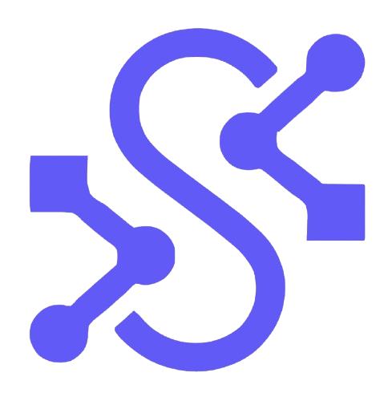
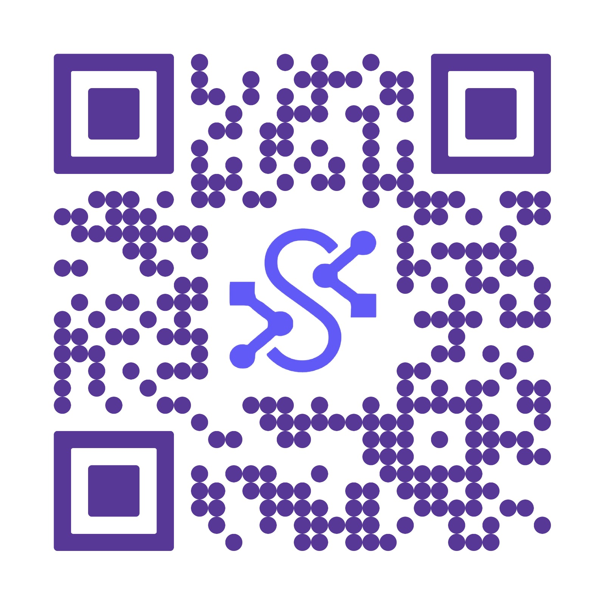

<p align="center">
  
</p>


#  Licita App - Frontend SECOP III


Bienvenido al repositorio del cliente web de **Licita API**. Esta interfaz ha sido diseñada con una misión clara: **Humanizar la contratación pública**.


A diferencia de la complejidad del SECOP tradicional, nuestra plataforma ofrece una experiencia **"Self-Explanatory" (Auto-explicativa)** y cordial, guiando a los nuevos usuarios paso a paso mediante una UI limpia, moderna y accesible.


---


##  Enlaces Rápidos

* ** Demo Desplegado:** [https://licita-app-demo.vercel.app](https://licita-app-demo.vercel.app) *(Reemplazar con tu link)*

* ** Documentación Backend:** [Link al Swagger/Redoc del Backend]

* ** Sistema de Diseño:** [Ver Design System](./DESIGN_SYSTEM.md)


---


##  Filosofía de Desarrollo & UX


### De Prototipo IA a Arquitectura Robusta

El desarrollo de este frontend siguió un enfoque híbrido de **Aceleración con IA + Ingeniería de Software**:

1.  **Fase de Ideación (Lovable):** Se utilizó *Lovable* para generar rápidamente una plantilla base y validar flujos de usuario (Wireframing inteligente).

2.  **Fase de Ingeniería (React + Vite):** El código fue migrado y refactorizado totalmente a una arquitectura profesional en **React**. Se optimizó el renderizado, se implementó tipado estricto con TypeScript y se integró con la API del Backend.


### Concepto "Cordialidad Digital"

El SECOP actual es intimidante. Nuestra interfaz es "cordial":

* **Carga Cognitiva Reducida:** No mostramos cientos de filtros de golpe. La información se revela progresivamente.

* **Micro-interacciones:** Feedback visual inmediato al usuario (loading states, tooltips explicativos).

* **Lenguaje Natural:** En lugar de códigos técnicos, usamos términos claros para describir las licitaciones.


---


## Las 4 Vistas Principales


La aplicación se estructura en 4 módulos clave diseñados para cubrir todo el ciclo de búsqueda de oportunidades:


### 1. Onboarding Inteligente (Smart Login)

No es solo un formulario de registro.

* **Función:** Detecta automáticamente el NIT de la empresa.

* **UX:** Valida en tiempo real si la empresa ya existe en base de datos y prepara el perfilamiento de IA desde el primer segundo.

* **Objetivo:** Eliminar la fricción de entrada.


### 2. Dashboard de Recomendaciones (The Match)

El corazón de la aplicación.

* **Función:** Muestra las licitaciones que hicieron "Match" con el perfil de la empresa (procesado por el Backend).

* **Visualización:** Tarjetas claras con un **"% de Compatibilidad"** y una explicación generada por IA de *por qué* esa licitación es buena para ti.


### 3. Explorador de Mercado (Search & Filter)

Para cuando el usuario quiere investigar manualmente.

* **Función:** Buscador semántico y filtros dinámicos.

* **UX:** Implementación de *Debounce* para búsquedas instantáneas sin saturar el servidor y filtros visuales (tags) fáciles de activar/desactivar.


### 4. Vista de Detalle y Análisis

La inmersión profunda.

* **Función:** Desglosa los pliegos de la licitación de forma legible.

* **Feature Clave:** Muestra gráficas de precios históricos y competencia (consumiendo los endpoints de análisis de mercado), permitiendo tomar decisiones basadas en datos, no en intuición.


---


##  Stack Tecnológico


##  Stack Tecnológico

| Tecnología | Propósito |
| :--- | :--- |
| **React 18** | Librería principal de UI (Component Based). |
| **TypeScript** | Seguridad de tipos y mantenibilidad del código. |
| **Vite** | Build tool de próxima generación (Hot Module Replacement instantáneo). |
| **Tailwind CSS** | Estilizado rápido y responsive. |
| **Shadcn/ui** | Colección de componentes accesibles y reutilizables. |
| **React Query** | Gestión de estado asíncrono y caché de datos del servidor. |
| **React Router** | Navegación SPA (Single Page Application). |


---


##  Instalación y Ejecución


Sigue estos pasos para levantar el entorno de desarrollo:


```bash

# 1. Clonar el repositorio

git clone <url-del-repo-frontend>


# 2. Instalar dependencias

npm install


# 3. Configurar Variables de Entorno

# Crea un archivo .env en la raíz y conecta tu Backend

echo "VITE_API_URL=http://localhost:8000/api/v1" > .env


# 4. Correr el servidor de desarrollo

npm run dev


src/

├── components/         # Bloques de UI (Botones, Cards, Modales)

│   └── ui/             # Componentes base de Shadcn

├── hooks/              # Lógica reutilizable (useAuth, useFetchLicitaciones)

├── lib/                # Utilidades y configuración de clientes (Axios)

├── pages/              # Las 4 Vistas Principales

│   ├── Auth/           # Login & Register

│   ├── Dashboard/      # Vista de Matches

│   ├── Explore/        # Buscador

│   └── Analysis/       # Detalle de Licitación

├── services/           # Comunicación con la API (Endpoints)

└── App.tsx             # Configuración de Rutas


```


<p align="center">
  
</p>
